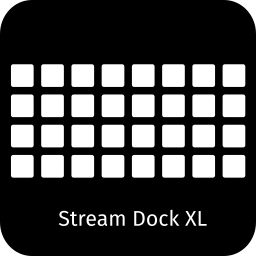

# OpenDeck Stream Dock XL Plugin

An unofficial plugin for VSD Inside / MiraBox Stream Dock XL-family devices.

This is a fork of [ambiso/opendeck-akp05](https://github.com/ambiso/opendeck-akp05) by [ambiso](https://github.com/ambiso) for their excellent encoder, led_config and heartbeat implementation that were easily adaptable and/or reusable as-is for the Stream Dock XL.

[ambiso/opendeck-akp05](https://github.com/ambiso/opendeck-akp05) is is a fork of [4ndv/opendeck-akp153](https://github.com/4ndv/opendeck-akp153) by [Andrey Viktorov](https://github.com/4ndv), which was a crutial starting point for adapting this project to the Stream Dock XL.

> [!WARNING]
> This plug-in is **NOT** for the Elgato Stream Deck XL product.

## OpenDeck version

Requires OpenDeck 2.5.0 or newer

## Supported devices

- Mirabox®️ Stream Dock XL (5548:1031)
- TBD

## Platform support

- Linux: ✅ Tested - using it personally for my Stream Dock XL
- Mac: ❌ Untested - but at least it compiles! it _might_ work if you're lucky.
- Windows: ❌ Untested - but at least it compiles! it _might_ work if you're lucky.

## Preparation

**ONLY** for Linux Users:

By default, Linux grants read-only access to USB input devices. To allow OpenDeck to program your Stream Dock XL device (buttons, icons, brightness), we need to grant write access via a simple system rule.

1.  Download [40-opendeck-stream-dock-xl.rules](https://github.com/mean-ui-thread/opendeck-stream-dock-xl/raw/refs/heads/main/40-opendeck-stream-dock-xl.rules)

2.  Install and apply the new write access rule for your Stream Dock XL device on your system:

```shell
sudo cp 40-opendeck-stream-dock-xl.rules /etc/udev/rules.d/
sudo udevadm control --reload-rules && sudo udevadm trigger
```

## Installation

1.  Download [opendeck-stream-dock-xl.plugin.zip](https://github.com/mean-ui-thread/opendeck-stream-dock-xl/releases/download/latest/opendeck-stream-dock-xl.plugin.zip)
2.  Launch OpenDeck:
    1. Click on `Plugins`
    2. Then click on `Install from file`
    3. Then select the [opendeck-stream-dock-xl.plugin.zip](https://github.com/mean-ui-thread/opendeck-stream-dock-xl/releases/download/latest/opendeck-stream-dock-xl.plugin.zip) you've downloaded.

## Knob LED configuration

By default no LED commands are sent, so the device keeps its own built-in effect.

To configure the side LEDs, create `~/.config/opendeck-stream-dock-xl/leds.toml`. (Windows: `%APPDATA%\opendeck-stream-dock-xl\leds.toml`, macOS: `~/Library/Application Support/opendeck-stream-dock-xl/leds.toml`)

```toml
    brightness = 100 # 0-100

    [mode.Static]
    colors = [[255, 0, 128]] # RGB
```

## Known issues

- There is unfortunately no way to control each LED side colors individually. Still unsure if this will be possible in the future.

## Building

### Prerequisites

You'll need:

- A Linux OS of some sort
- Rust 1.95.0 and up with `x86_64-unknown-linux-gnu` and `x86_64-pc-windows-gnu` targets installed
- Docker
- [just](https://just.systems)

### Building a release package

```sh
$ just package
```

## Acknowledgments

This plugin implementation is a fork of This is a fork of [ambiso/opendeck-akp05](https://github.com/ambiso/opendeck-akp05) by [ambiso](https://github.com/ambiso) which is a fork of [opendeck-akp153](https://github.com/4ndv/opendeck-akp153) by [Andrey Viktorov](https://github.com/4ndv).

I also found a lot of information from [MiraboxSpace/StreamDock-Device-SDK](https://github.com/MiraboxSpace/StreamDock-Device-SDK/blob/bc08f2cffceb03b01adda185d056c8e8c824a480/CPP-SDK/src/HotspotDevice/StreamDockXL/streamdockXL.cpp) which helped me figuring out how to map my images and inputs with `openaction` and `mirajazz`

## License

GPL-3.0 (same as the original plugin)
